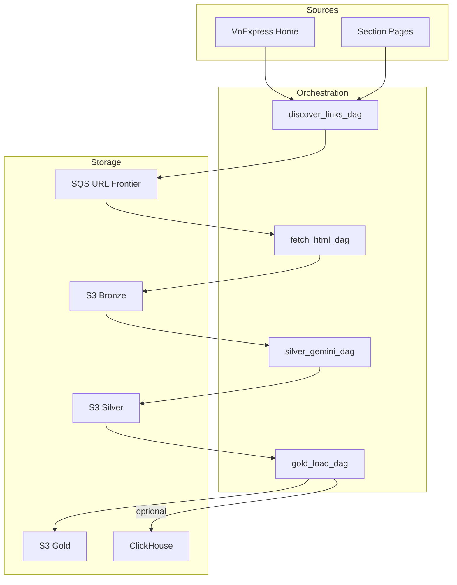
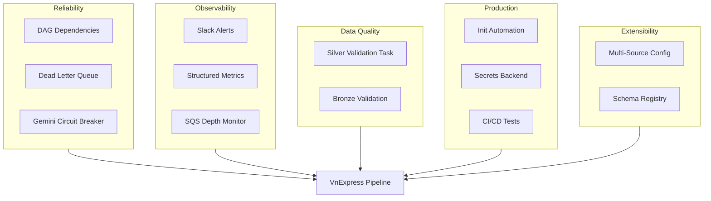

# Architecture Improvement Plan — VnExpress Crawler

This plan identifies improvement areas across the pipeline (Plans 1–7) and suggests concrete enhancements for reliability, observability, scalability, and production readiness.

---

## Current Architecture Snapshot

---

## 1. DAG Dependency and Data-Driven Orchestration

**Current state:** DAGs use fixed cron schedules (discover 0 2, fetch 10 2, silver 0 4, gold 0 5) with no explicit data dependencies. If discover fails, fetch still runs; if bronze is empty, silver processes nothing but still succeeds.

**Improvements:**

- Add **explicit DAG dependencies** via `ExternalTaskSensor` or `TriggerDagRunOperator`: fetch waits for discover success; silver waits for fetch; gold waits for silver.
- Or create a **master DAG** that triggers child DAGs in sequence and only proceeds when the previous run succeeds.
- Use **data-aware scheduling**: silver could use `S3KeySensor` to wait for bronze partition before running.
- Add **backfill safety**: parameterize `ingestion_date` so backfills use the correct date; avoid re-processing same date unnecessarily.

**Key files:** [src/dags/vnexpress_full_flow/](src/dags/vnexpress_full_flow/), [.cursor/rules/06-airflow-dags.mdc](.cursor/rules/06-airflow-dags.mdc)

---

## 2. Error Handling and Resilience

**Current state:** Basic retries on fetch/silver; SQS messages deleted on success; failed Gemini extractions are skipped (logged, no dead-letter).

**Improvements:**

- **Dead-letter queue (DLQ)** for SQS: move messages that fail fetch (4xx, 5xx, timeout) after N retries to a DLQ for inspection and manual retry.
- **Failed article tracking**: silver DAG could write `article_id` and error reason to S3 or a small table for retry or analysis.
- **Circuit breaker for Gemini**: if rate limit (429) exceeds a threshold, stop further calls and fail the task with clear message instead of long retries.
- **Partial failure handling**: silver processes many HTML files; if 90% fail, consider failing the task vs. writing partial output (configurable threshold).
- **Idempotent S3 writes**: ensure bronze overwrite by `article_id` is intentional; silver/gold dedupe already handles re-runs.

**Key files:** [src/dags/utils/gemini_extract.py](src/dags/utils/gemini_extract.py), [src/dags/vnexpress_full_flow/vnexpress_fetch_html_dag.py](src/dags/vnexpress_full_flow/vnexpress_fetch_html_dag.py)

---

## 3. Observability and Alerting

**Current state:** Logging in tasks; Plan 6 mentions Slack; no structured metrics.

**Improvements:**

- **Slack alerts on failure**: add `SlackWebhookOperator` with `trigger_rule="one_failed"` to each DAG (already in [dag-airflow-patterns](.cursor/skills/dag-airflow-patterns/SKILL.md)).
- **Structured metrics**: log or emit counts (URLs discovered, fetched, extracted, gold rows) as Airflow XCom or to a simple metrics store (e.g. StatsD, Prometheus) for dashboards.
- **SQS depth monitoring**: alert if queue depth grows unbounded (discover outpacing fetch) or stays at zero for extended periods.
- **Data freshness checks**: gold DAG could validate that `ingestion_date` matches expected; alert if no gold output for N days.
- **Task duration tracking**: log task runtime for fetch/silver to detect slowdowns (Gemini latency, network).

**Key files:** [docker-compose.yml](docker-compose.yml), [.cursor/rules/06-airflow-dags.mdc](.cursor/rules/06-airflow-dags.mdc)

---

## 4. Configuration and Secrets Management

**Current state:** Variables in Airflow UI; config in YAML; Gemini key in Variable; no env-based overrides in code.

**Improvements:**

- **Secrets backend**: use Airflow Secrets Backend (e.g. AWS Secrets Manager, HashiCorp Vault) for `gemini_api_key` in production instead of Airflow Variables.
- **Env-specific configs**: support `vnexpress_bronze_local.yml` vs `vnexpress_bronze_prod.yml` or `configs/bronze/vnexpress_bronze_{env}.yml` selected by `vnexpress_environment` Variable.
- **Variable fallback to env**: allow `GEMINI_API_KEY` env var as fallback when Variable is not set (useful for local/dev).
- **Config validation at load**: validate YAML schema (required keys, types) when loading configs; fail fast with clear errors.

**Key files:** [src/dags/utils/helper.py](src/dags/utils/helper.py), [src/dags/configs/](src/dags/configs/)

---

## 5. URL Deduplication and Backpressure

**Current state:** Discover pushes all new URLs to SQS each run; no check if URL already in bronze; SQS can grow without bound if fetch is slow.

**Improvements:**

- **URL seen cache**: before pushing to SQS, check if `article_id` (or URL) already exists in bronze for recent dates; skip or reduce duplicates (optional, adds complexity).
- **SQS message attributes**: add `discovery_date` and `source` for better visibility; use visibility timeout to prevent duplicate processing when workers overlap.
- **Backpressure**: if SQS depth > threshold, pause discover or reduce discovery rate; or run fetch more frequently.
- **Priority queues** (advanced): separate SQS queues for "new" vs "retry" URLs with different worker priorities.

**Key files:** [src/dags/vnexpress_full_flow/vnexpress_discover_links_dag.py](src/dags/vnexpress_full_flow/vnexpress_discover_links_dag.py), [.cursor/rules/02-ingestion-layer.mdc](.cursor/rules/02-ingestion-layer.mdc)

---

## 6. Data Quality and Validation Pipelines

**Current state:** Plan 6 adds `validate_silver_schema`; no bronze validation; no automated data-quality DAG.

**Improvements:**

- **Bronze validation**: check HTML length, basic structure (e.g. `<title>` present); optionally reject obviously bad HTML before silver.
- **Silver validation task**: integrate `validate_silver_schema` as a task in silver DAG or a separate validation DAG that runs after silver; fail or alert on schema violations.
- **Gold validation**: assert row counts, section distribution, or other invariants before writing to ClickHouse.
- **Data quality dashboard**: export validation results to a simple store (e.g. Parquet, DB) for trend analysis; or use Great Expectations / similar if scale justifies.
- **Anomaly detection** (optional): alert if article count per section drops by >50% compared to rolling average.

**Key files:** [.cursor/plans/plan_6_tests_e2e_60c67d9f.plan.md](.cursor/plans/plan_6_tests_e2e_60c67d9f.plan.md), [.cursor/rules/07-data-quality-and-testing.mdc](.cursor/rules/07-data-quality-and-testing.mdc)

---

## 7. Production Readiness

**Current state:** Localstack for S3/SQS; test credentials; single Airflow instance; no production deployment guide.

**Improvements:**

- **Real AWS migration path**: document switching from Localstack to real S3/SQS (bucket/queue creation, IAM roles, connection config); use same code with env-specific Variables.
- **Init automation**: add `scripts/init_localstack.sh` (or docker init container) to create bucket and queue on startup; reduce manual setup.
- **Resource limits**: set memory/CPU limits for Airflow services in docker-compose to avoid OOM in production.
- **Health checks**: ensure all services (postgres, redis, localstack, clickhouse, airflow) have proper healthchecks; airflow-worker depends on Redis.
- **CI/CD**: add GitHub Actions or similar to run `pytest` on push; optionally run E2E against Localstack in CI.
- **Version pinning**: pin all dependency versions in requirements; document upgrade path.

**Key files:** [docker-compose.yml](docker-compose.yml), [LOCAL_SETUP.md](LOCAL_SETUP.md), [resource reference/requirements_local.txt](resource reference/requirements_local.txt)

---

## 8. Modularity and Extensibility

**Current state:** Single source (VnExpress); configs and DAGs are VnExpress-specific but utils are generic.

**Improvements:**

- **Multi-source pattern**: structure configs as `configs/bronze/{source}_bronze.yml`; DAGs could be parameterized by source (e.g. `vnexpress`, future `dantri`) with shared utils.
- **Pluggable extractors**: abstract `extract_article_from_html` behind an interface; allow different extractors (Gemini, regex, BeautifulSoup) per source.
- **Shared DAG factory**: create a `create_crawler_dag(source, config_path)` factory to reduce boilerplate when adding new sources.
- **Reusable operators**: extract fetch/silver logic into custom Airflow Operators (e.g. `FetchHtmlOperator`, `GeminiExtractOperator`) for reuse across DAGs.
- **Schema registry**: define article schema (Pydantic or JSON Schema) in one place; validate silver/gold against it.

**Key files:** [src/dags/vnexpress_full_flow/](src/dags/vnexpress_full_flow/), [src/dags/configs/](src/dags/configs/)

---

## Suggested Implementation Order

| Priority | Area                          | Effort | Impact    |
| -------- | ----------------------------- | ------ | --------- |
| 1        | DAG dependencies (sensors)    | Medium | High      |
| 2        | Slack alerts on failure       | Low    | High      |
| 3        | Init automation (init script) | Low    | Medium    |
| 4        | Silver validation task        | Low    | Medium    |
| 5        | Env fallback for Gemini key   | Low    | Medium    |
| 6        | Dead-letter queue (SQS)       | Medium | Medium    |
| 7        | Failed article tracking       | Medium | Medium    |
| 8        | Multi-source structure        | High   | Long-term |

---

## Summary Diagram: Improvement Areas

---

## Key References

- **Architecture:** [.cursor/rules/01-architecture-overview.mdc](.cursor/rules/01-architecture-overview.mdc)
- **DAGs:** [.cursor/rules/06-airflow-dags.mdc](.cursor/rules/06-airflow-dags.mdc)
- **Data Quality:** [.cursor/rules/07-data-quality-and-testing.mdc](.cursor/rules/07-data-quality-and-testing.mdc)
- **Plans:** [.cursor/plans/](.cursor/plans/)

