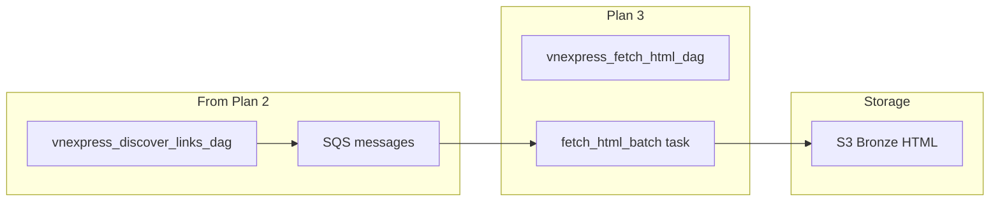

# Plan 3: Fetch HTML DAG

After Plan 1 (init) and Plan 2 (utils, discover DAG), implement the HTML Fetch DAG. Reference: [vnexpress_manual_step_by_step_plan.plan.md](vnexpress_manual_step_by_step_plan.plan.md) Phase 5.

---

## Dependency


| Prerequisite                                 | Plan                                                                           |
| -------------------------------------------- | ------------------------------------------------------------------------------ |
| SQS queue with messages from discover DAG    | [plan_2_utils_and_discover_dag.plan.md](plan_2_utils_and_discover_dag.plan.md) |
| Bronze config (s3_output_prefix, batch_size) | [plan_1_init_project.plan.md](plan_1_init_project.plan.md)                     |
| S3 bucket, aws_dag_executor connection       | [plan_1_init_project.plan.md](plan_1_init_project.plan.md)                     |


---

## Phases in This Plan


| Phase | Goal                                       |
| ----- | ------------------------------------------ |
| 1     | Add fetch utils (derive_article_id)        |
| 2     | Create vnexpress_fetch_html_dag.py         |
| 3     | Unit tests for fetch logic                 |
| 4     | Verification: discover → fetch → S3 bronze |


---

## Phase 1: Fetch Utils

**Goal:** Helper to derive stable article_id from URL; keep logic testable.


| Step | Action                                                                                                                                 | Reference                                                            |
| ---- | -------------------------------------------------------------------------------------------------------------------------------------- | -------------------------------------------------------------------- |
| 1.1  | Add `derive_article_id(url: str) -> str` in `utils/url_utils.py` or new `utils/fetch_utils.py`                                         | [02-ingestion-layer.mdc](.cursor/rules/02-ingestion-layer.mdc)       |
| 1.2  | Use `hashlib.sha256(url.encode()).hexdigest()[:16]` or extract slug from path (e.g. `slug-1234567890` from `.../slug-1234567890.html`) | [03-raw-storage-bronze.mdc](.cursor/rules/03-raw-storage-bronze.mdc) |


**Check:** `derive_article_id("https://vnexpress.net/thoi-su-123.html")` returns a stable 16-char string.

---

## Phase 2: Fetch HTML DAG

**Goal:** DAG that drains SQS, fetches HTML per URL, writes to S3 bronze, deletes message on success.


| Step | Action                                                                                               | Reference                                                            |
| ---- | ---------------------------------------------------------------------------------------------------- | -------------------------------------------------------------------- |
| 2.1  | Create `vnexpress_full_flow/vnexpress_fetch_html_dag.py`                                             | [06-airflow-dags.mdc](.cursor/rules/06-airflow-dags.mdc)             |
| 2.2  | `@dag` schedule `10 2 * * `* (10 min after discover) or `0 3 * * *`                                  | [06-airflow-dags.mdc](.cursor/rules/06-airflow-dags.mdc)             |
| 2.3  | `@task fetch_html_batch`: load bronze config, get queue_url + bucket from Variables                  | [02-ingestion-layer.mdc](.cursor/rules/02-ingestion-layer.mdc)       |
| 2.4  | `SqsHook.receive_messages(queue_url, max_number_of_messages=batch_size)`                             | [s3-sqs-ingestion](.cursor/skills/s3-sqs-ingestion/SKILL.md)         |
| 2.5  | For each message: parse JSON → url, source, ingestion_date; GET url; derive article_id; build S3 key | [03-raw-storage-bronze.mdc](.cursor/rules/03-raw-storage-bronze.mdc) |
| 2.6  | Key: `{prefix}ingestion_date={ds}/source={source}/article_id={id}.html`                              | [03-raw-storage-bronze.mdc](.cursor/rules/03-raw-storage-bronze.mdc) |
| 2.7  | `s3_hook.load_bytes(html.encode("utf-8"), key=key, bucket_name=bucket, replace=True)`                | [02-ingestion-layer.mdc](.cursor/rules/02-ingestion-layer.mdc)       |
| 2.8  | `sqs_hook.delete_message(queue_url, receipt_handle=msg["ReceiptHandle"])` on success                 | [02-ingestion-layer.mdc](.cursor/rules/02-ingestion-layer.mdc)       |
| 2.9  | Loop until queue empty or max iterations (e.g. 100 batches) to avoid runaway                         | [06-airflow-dags.mdc](.cursor/rules/06-airflow-dags.mdc)             |


**Check:** Run discover DAG first; then trigger fetch DAG; `aws s3 ls s3://vnexpress-data/vnexpress/bronze/ --recursive` shows `.html` files.

---

## Phase 3: Unit Tests

**Goal:** Test derive_article_id; optional: test fetch logic with mocked SQS/S3.


| Step | Action                                                                                   | Reference                                                                        |
| ---- | ---------------------------------------------------------------------------------------- | -------------------------------------------------------------------------------- |
| 3.1  | Add `test_derive_article_id` in `tests/test_url_utils.py` or `tests/test_fetch_utils.py` | [07-data-quality-and-testing.mdc](.cursor/rules/07-data-quality-and-testing.mdc) |
| 3.2  | Assert same URL yields same id; different URLs yield different ids                       | [validation-testing](.cursor/skills/validation-testing/SKILL.md)                 |


**Check:** `pytest tests/test_url_utils.py tests/test_fetch_utils.py -v` passes.

---

## Phase 4: Verification

**Goal:** End-to-end flow: discover → fetch → S3 bronze has HTML.


| Step | Action                                                                                                     | Reference                                                                    |
| ---- | ---------------------------------------------------------------------------------------------------------- | ---------------------------------------------------------------------------- |
| 4.1  | Run `vnexpress_discover_links_dag` (or ensure SQS has messages)                                            | [LOCAL_SETUP.md](LOCAL_SETUP.md)                                             |
| 4.2  | Trigger `vnexpress_fetch_html_dag`                                                                         | [12-docker-compose-testing.mdc](.cursor/rules/12-docker-compose-testing.mdc) |
| 4.3  | Verify: `aws --endpoint-url=http://localhost:4566 s3 ls s3://vnexpress-data/vnexpress/bronze/ --recursive` | [03-raw-storage-bronze.mdc](.cursor/rules/03-raw-storage-bronze.mdc)         |


**Check:** S3 bronze prefix has `ingestion_date=YYYY-MM-DD/source=.../article_id=....html` objects.

---

## Data Flow




---

## Key Snippets

**S3 key pattern** (from [03-raw-storage-bronze.mdc](.cursor/rules/03-raw-storage-bronze.mdc)):

```python
key = f"{prefix}ingestion_date={ingestion_date}/source={source}/article_id={article_id}.html"
s3_hook.load_bytes(html.encode("utf-8"), key=key, bucket_name=bucket, replace=True)
```

**SQS receive and delete** (from [02-ingestion-layer.mdc](.cursor/rules/02-ingestion-layer.mdc)):

```python
messages = sqs_hook.receive_messages(queue_url=queue_url, max_number_of_messages=10)
for msg in messages:
    body = json.loads(msg["Body"])
    # fetch, write, then:
    sqs_hook.delete_message(queue_url=queue_url, receipt_handle=msg["ReceiptHandle"])
```

---

## Next Plan

After Plan 3, proceed to Plan 4 (Silver DAG with Gemini) or Plan 5 (Gold) from [vnexpress_manual_step_by_step_plan.plan.md](vnexpress_manual_step_by_step_plan.plan.md) Phase 6.

---

## Key References

- **Ingestion:** [.cursor/rules/02-ingestion-layer.mdc](.cursor/rules/02-ingestion-layer.mdc)
- **Bronze storage:** [.cursor/rules/03-raw-storage-bronze.mdc](.cursor/rules/03-raw-storage-bronze.mdc)
- **DAGs:** [.cursor/rules/06-airflow-dags.mdc](.cursor/rules/06-airflow-dags.mdc)
- **S3/SQS:** [.cursor/skills/s3-sqs-ingestion/SKILL.md](.cursor/skills/s3-sqs-ingestion/SKILL.md)
- **Local setup:** [LOCAL_SETUP.md](LOCAL_SETUP.md)

