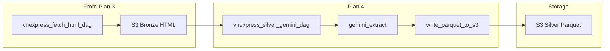

# Plan 4: Silver DAG with Gemini

After Plan 1 (init), Plan 2 (utils, discover DAG), and Plan 3 (fetch HTML DAG), implement the Silver layer: read bronze HTML from S3, call Gemini to extract structured article fields, deduplicate by article_id, write Parquet to S3 silver. Reference: [vnexpress_manual_step_by_step_plan.plan.md](.cursor/plans/vnexpress_manual_step_by_step_plan.plan.md) Phase 6.

---

## Dependencies


| Prerequisite                                            | Plan                                                                         |
| ------------------------------------------------------- | ---------------------------------------------------------------------------- |
| Bronze HTML in S3 from fetch DAG                        | [plan_3_fetch_html_dag.plan.md](.cursor/plans/plan_3_fetch_html_dag.plan.md) |
| Silver config (gemini_model, batch_size, silver_prefix) | [plan_1_init_project.plan.md](.cursor/plans/plan_1_init_project.plan.md)     |
| write_parquet_to_s3 in utils                            | [plan_1_init_project.plan.md](.cursor/plans/plan_1_init_project.plan.md)     |


---

## Gemini Credentials (Do Not Commit)

Configure via Airflow UI or env (never commit keys):

- **Airflow UI** → Admin → Variables → Add:
  - `gemini_api_key` = your API key
  - `gemini_model` = `gemini-2.5-flash` (or use silver YAML override)
- **Or** docker-compose `environment` for Airflow services: `GEMINI_API_KEY`, `GEMINI_MODEL` (code reads from `Variable.get` with env fallback).

---

## Phases in This Plan


| Phase | Goal                                                   |
| ----- | ------------------------------------------------------ |
| 1     | Add google-generativeai dependency                     |
| 2     | Update silver config for gemini-2.5-flash              |
| 3     | Create utils/gemini_extract.py                         |
| 4     | Add extract_article_id_from_key helper for bronze keys |
| 5     | Create vnexpress_silver_gemini_dag.py                  |
| 6     | Unit tests for gemini_extract                          |
| 7     | Verification: discover → fetch → silver → S3 Parquet   |


---

## Phase 1: Add Dependency

**Goal:** Install `google-generativeai` for Gemini API.


| Step | Action                                                                                                                               |
| ---- | ------------------------------------------------------------------------------------------------------------------------------------ |
| 1.1  | Add `google-generativeai` (e.g. `>=0.8.0`) to [resource reference/requirements_local.txt](resource reference/requirements_local.txt) |
| 1.2  | Rebuild image: `docker compose build airflow-webserver` (or rebuild all)                                                             |


**Check:** `docker compose run --rm airflow-cli python -c "import google.generativeai as genai; print(genai.__version__)"` succeeds.

---

## Phase 2: Update Silver Config

**Goal:** Use `gemini-2.5-flash` per user preference.


| Step | Action                                                                                                                                                                           |
| ---- | -------------------------------------------------------------------------------------------------------------------------------------------------------------------------------- |
| 2.1  | Update [src/dags/configs/silver/vnexpress_silver.yml](src/dags/configs/silver/vnexpress_silver.yml): set `gemini_model: "gemini-2.5-flash"` (or keep from Variable if preferred) |


The config should support reading model from Variable as override:

```yaml
data_config:
  gemini_model: "gemini-2.5-flash"   # fallback if Variable not set
  max_body_chars: 8000
  batch_size: 5
  silver_prefix: "vnexpress/silver/"
```

---

## Phase 3: Create gemini_extract.py

**Goal:** Extract structured article JSON from HTML via Gemini.


| Step | Action                                                                                                        | Reference                                                                    |
| ---- | ------------------------------------------------------------------------------------------------------------- | ---------------------------------------------------------------------------- |
| 3.1  | Create `src/dags/utils/gemini_extract.py`                                                                     | [gemini-silver-extraction](.cursor/skills/gemini-silver-extraction/SKILL.md) |
| 3.2  | Implement `extract_article_from_html(html: str, api_key: str, model: str, max_body_chars: int = 8000) -> dict | None`                                                                        |
| 3.3  | Use extraction prompt (title, section, published_at, summary, main_entities, tags, body_text, url)            | [gemini-silver-extraction](.cursor/skills/gemini-silver-extraction/SKILL.md) |
| 3.4  | Parse JSON from response; validate required fields (title, url); return None on failure                       | [04-transform-silver.mdc](.cursor/rules/04-transform-silver.mdc)             |
| 3.5  | Add retries with backoff on 429/rate-limit (e.g. 3 attempts, sleep 60 * (attempt+1) s)                        | [gemini-silver-extraction](.cursor/skills/gemini-silver-extraction/SKILL.md) |
| 3.6  | Optionally preprocess HTML: strip scripts/styles, truncate to max_body_chars to reduce tokens                 | [04-transform-silver.mdc](.cursor/rules/04-transform-silver.mdc)             |


**Extraction prompt** (from skill):

```
Extract from this Vietnamese news article HTML the following fields in JSON:
- title (string)
- url (string, canonical article URL)
- section (string, e.g. Thời sự, Thế giới, Kinh doanh)
- published_at (ISO8601 or null)
- summary (string)
- main_entities (list of strings)
- tags (list of strings)
- body_text (string, max 5000 chars)

Respond with a JSON object and nothing else.
```

---

## Phase 4: Add extract_article_id_from_key

**Goal:** Derive article_id from bronze S3 key for silver record enrichment.


| Step | Action                                                                                                                                            |
| ---- | ------------------------------------------------------------------------------------------------------------------------------------------------- |
| 4.1  | Add `extract_article_id_from_key(key: str) -> str` in [src/dags/utils/url_utils.py](src/dags/utils/url_utils.py) (or new `utils/bronze_utils.py`) |
| 4.2  | Bronze key format: `vnexpress/bronze/ingestion_date=.../source=.../article_id=<id>.html` → extract `<id>` using regex or split                    |


Example:

```python
def extract_article_id_from_key(key: str) -> str:
    """Extract article_id from bronze S3 key: .../article_id=<id>.html"""
    match = re.search(r"article_id=([^.]+)\.html", key)
    return match.group(1) if match else ""
```

---

## Phase 5: Create vnexpress_silver_gemini_dag.py

**Goal:** DAG that lists bronze HTML, calls Gemini, writes Parquet to silver.


| Step | Action                                                                                                                                                                         | Reference                                                                    |
| ---- | ------------------------------------------------------------------------------------------------------------------------------------------------------------------------------ | ---------------------------------------------------------------------------- |
| 5.1  | Create `src/dags/vnexpress_full_flow/vnexpress_silver_gemini_dag.py`                                                                                                           | [06-airflow-dags.mdc](.cursor/rules/06-airflow-dags.mdc)                     |
| 5.2  | `@dag` schedule `0 4 `* * * (or 1–2h after fetch); `retries=2`, `retry_delay=60`                                                                                               | [06-airflow-dags.mdc](.cursor/rules/06-airflow-dags.mdc)                     |
| 5.3  | `@task run_silver_gemini`: load silver config; get `bucket`, `gemini_api_key`, `gemini_model` from Variables (model: Variable or config)                                       | [dag-airflow-patterns](.cursor/skills/dag-airflow-patterns/SKILL.md)         |
| 5.4  | `keys = s3_hook.list_keys(bucket, prefix=f"{bronze_prefix}ingestion_date={{ ds }}/")`; filter `.html`                                                                          | [04-transform-silver.mdc](.cursor/rules/04-transform-silver.mdc)             |
| 5.5  | For each key: `html = s3_hook.read_key(key, bucket)`; call `extract_article_from_html`; enrich with `article_id` (from key), `ingestion_date`, `first_seen_at`, `last_seen_at` | [04-transform-silver.mdc](.cursor/rules/04-transform-silver.mdc)             |
| 5.6  | Deduplicate: `df.drop_duplicates(subset=["article_id"], keep="last")`                                                                                                          | [gemini-silver-extraction](.cursor/skills/gemini-silver-extraction/SKILL.md) |
| 5.7  | `write_parquet_to_s3(s3_hook, df, bucket, silver_prefix + f"ingestion_date={{ ds }}/")`                                                                                        | [s3_utils.py](src/dags/utils/s3_utils.py)                                    |


**Bronze prefix:** Use `s3_output_prefix` from bronze config or hardcode `vnexpress/bronze/` to match fetch DAG.

---

## Phase 6: Unit Tests

**Goal:** Test extraction logic with mocked Gemini.


| Step | Action                                                                                                                                             | Reference                                                                        |
| ---- | -------------------------------------------------------------------------------------------------------------------------------------------------- | -------------------------------------------------------------------------------- |
| 6.1  | Create `tests/test_gemini_extract.py`                                                                                                              | [validation-testing](.cursor/skills/validation-testing/SKILL.md)                 |
| 6.2  | `test_extract_article_from_html`: use `@patch` on `genai.GenerativeModel` or the generate call; assert returned dict has title, url, section, etc. | [validation-testing](.cursor/skills/validation-testing/SKILL.md)                 |
| 6.3  | `test_extract_article_id_from_key`: assert `extract_article_id_from_key("vnexpress/bronze/.../article_id=abc123.html") == "abc123"`                | [07-data-quality-and-testing.mdc](.cursor/rules/07-data-quality-and-testing.mdc) |


**Check:** `PYTHONPATH=.:src/dags pytest tests/test_gemini_extract.py -v` passes.

---

## Phase 7: Verification

**Goal:** End-to-end flow: bronze → silver Parquet in S3.


| Step | Action                                                                                                                            |
| ---- | --------------------------------------------------------------------------------------------------------------------------------- |
| 7.1  | Ensure discover → fetch have run (or run them) so bronze has HTML                                                                 |
| 7.2  | Set Airflow Variables: `gemini_api_key`, `gemini_model` (or rely on config)                                                       |
| 7.3  | Trigger `vnexpress_silver_gemini_dag` (use logical date = ingestion_date with data)                                               |
| 7.4  | Verify: `aws --endpoint-url=http://localhost:4566 s3 ls s3://vnexpress-data/vnexpress/silver/ --recursive` shows `.parquet` files |


---

## Data Flow




---

## Key Snippets

**List bronze and call Gemini** ([04-transform-silver.mdc](.cursor/rules/04-transform-silver.mdc)):

```python
keys = [k for k in s3_hook.list_keys(bucket, prefix=f"vnexpress/bronze/ingestion_date={ds}/") if k.endswith(".html")]
records = []
for key in keys:
    html = s3_hook.read_key(key, bucket)
    data = extract_article_from_html(html, api_key, model, max_body_chars)
    if data:
        article_id = extract_article_id_from_key(key)
        records.append({**data, "article_id": article_id, "ingestion_date": ds})
df = pd.DataFrame(records)
df = df.drop_duplicates(subset=["article_id"], keep="last")
write_parquet_to_s3(s3_hook, df, bucket, f"vnexpress/silver/ingestion_date={ds}/")
```

**Variable/model resolution:**

```python
api_key = Variable.get("gemini_api_key")
model = Variable.get("gemini_model", default_var=config["data_config"]["gemini_model"])
```

---

## Next Plan

After Plan 4, proceed to [plan_5_gold_load_dag.plan.md](.cursor/plans/plan_5_gold_load_dag.plan.md) (Phase 7: Gold DAG).

---

## Key References

- **Silver/Gemini:** [.cursor/rules/04-transform-silver.mdc](.cursor/rules/04-transform-silver.mdc)
- **Gemini extraction:** [.cursor/skills/gemini-silver-extraction/SKILL.md](.cursor/skills/gemini-silver-extraction/SKILL.md)
- **Config:** [.cursor/skills/config-yaml-bronze-silver-gold/SKILL.md](.cursor/skills/config-yaml-bronze-silver-gold/SKILL.md)
- **Testing:** [.cursor/skills/validation-testing/SKILL.md](.cursor/skills/validation-testing/SKILL.md)

