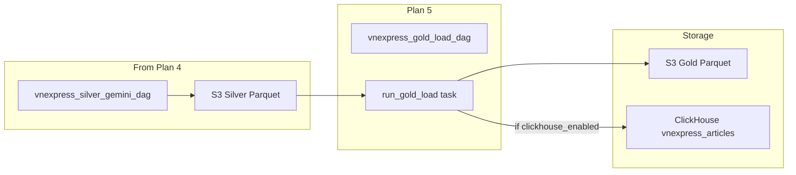

# Plan 5: Gold Load DAG

After Plan 1 (init) through Plan 4 (Silver DAG), implement the Gold layer: read silver Parquet from S3, deduplicate by article_id, write analytics-ready Parquet to S3 gold, and optionally bulk insert into ClickHouse for dashboards. Reference: [vnexpress_manual_step_by_step_plan.plan.md](.cursor/plans/vnexpress_manual_step_by_step_plan.plan.md) Phase 7.

---

## Dependency


| Prerequisite                         | Plan                                                                                                 |
| ------------------------------------ | ---------------------------------------------------------------------------------------------------- |
| Silver Parquet in S3 from silver DAG | [plan_4_silver_gemini_dag_6aad1f38.plan.md](.cursor/plans/plan_4_silver_gemini_dag_6aad1f38.plan.md) |
| Gold config (gold_prefix)            | [plan_1_init_project.plan.md](.cursor/plans/plan_1_init_project.plan.md)                             |
| write_parquet_to_s3 in utils         | [plan_1_init_project.plan.md](.cursor/plans/plan_1_init_project.plan.md)                             |


---

## Phases in This Plan


| Phase | Goal                                     |
| ----- | ---------------------------------------- |
| 0     | Add ClickHouse to Docker Compose (local) |
| 1     | Create vnexpress_gold_load_dag.py        |
| 2     | Add ClickHouse bulk insert to gold DAG   |
| 3     | Unit tests for gold logic (optional)     |
| 4     | Verification: S3 gold + ClickHouse query |


---

## Phase 0: ClickHouse Local (Docker Compose)

**Goal:** Add ClickHouse to the stack for local analytics; create table and Airflow connection.


| Step | Action                                                                                                                                         | Reference                                                                          |
| ---- | ---------------------------------------------------------------------------------------------------------------------------------------------- | ---------------------------------------------------------------------------------- |
| 0.1  | Add `clickhouse` service to [docker-compose.yml](docker-compose.yml): image `clickhouse/clickhouse-server`, ports 8123 (HTTP), 9000 (native)   | [05-analytics-gold-clickhouse.mdc](.cursor/rules/05-analytics-gold-clickhouse.mdc) |
| 0.2  | Configure `ulimit nofile=262144:262144` (required by ClickHouse)                                                                               | ClickHouse Docker docs                                                             |
| 0.3  | Add healthcheck: `wget -qO- http://localhost:8123/ping` or `clickhouse-client --query "SELECT 1"`                                              | [12-docker-compose-testing.mdc](.cursor/rules/12-docker-compose-testing.mdc)       |
| 0.4  | Create init script or DAG task to run DDL: `CREATE TABLE IF NOT EXISTS default.vnexpress_articles (...)`                                       | [05-analytics-gold-clickhouse.mdc](.cursor/rules/05-analytics-gold-clickhouse.mdc) |
| 0.5  | Airflow UI → Connections → Add: `clickhouse_default`, Connection Type `Generic`, Host `clickhouse`, Port `9000` (native) or use HTTP port 8123 | [12-docker-compose-testing.mdc](.cursor/rules/12-docker-compose-testing.mdc)       |
| 0.6  | Add Variable `clickhouse_enabled` = `true` (local) or `false` (S3-only)                                                                        | [05-analytics-gold-clickhouse.mdc](.cursor/rules/05-analytics-gold-clickhouse.mdc) |


**ClickHouse table schema** (ReplacingMergeTree for upsert by article_id):

```sql
CREATE TABLE IF NOT EXISTS default.vnexpress_articles (
    article_id String,
    url String,
    title String,
    section String,
    published_at Nullable(DateTime64(3)),
    summary String,
    body_text String,
    main_entities Array(String),
    tags Array(String),
    first_seen_at DateTime64(3),
    last_seen_at DateTime64(3),
    ingestion_date Date
) ENGINE = ReplacingMergeTree(last_seen_at)
PARTITION BY toYYYYMM(ingestion_date)
ORDER BY (section, last_seen_at, article_id);
```

**Check:** `docker compose up -d clickhouse`; `docker compose exec clickhouse clickhouse-client --query "SELECT 1"` succeeds.

---

## Phase 1: Gold Load DAG

**Goal:** DAG that reads silver Parquet, dedupes, writes gold to S3.


| Step | Action                                                                                                             | Reference                                                                          |
| ---- | ------------------------------------------------------------------------------------------------------------------ | ---------------------------------------------------------------------------------- |
| 1.1  | Create `vnexpress_full_flow/vnexpress_gold_load_dag.py`                                                            | [06-airflow-dags.mdc](.cursor/rules/06-airflow-dags.mdc)                           |
| 1.2  | `@dag` schedule `0 5` * * * (1h after silver at 0 4)                                                               | [06-airflow-dags.mdc](.cursor/rules/06-airflow-dags.mdc)                           |
| 1.3  | `@task run_gold_load`: load gold config; get bucket from Variables                                                 | [05-analytics-gold-clickhouse.mdc](.cursor/rules/05-analytics-gold-clickhouse.mdc) |
| 1.4  | List silver keys: `s3_hook.list_keys(bucket, prefix=f"{silver_prefix}ingestion_date={{ ds }}/")` filter `.parquet` | [05-analytics-gold-clickhouse.mdc](.cursor/rules/05-analytics-gold-clickhouse.mdc) |
| 1.5  | Read each Parquet: `pd.read_parquet(io.BytesIO(s3_hook.read_key(k, bucket)))`; concat DataFrames                   | [05-analytics-gold-clickhouse.mdc](.cursor/rules/05-analytics-gold-clickhouse.mdc) |
| 1.6  | Dedupe: `df.drop_duplicates(subset=["article_id"], keep="last")`                                                   | [05-analytics-gold-clickhouse.mdc](.cursor/rules/05-analytics-gold-clickhouse.mdc) |
| 1.7  | `write_parquet_to_s3(s3_hook, df, bucket, f"{gold_prefix}ingestion_date={{ ds }}/")`                               | [s3_utils.py](src/dags/utils/s3_utils.py)                                          |
| 1.8  | Optional: write `counts_by_section` aggregate to separate Parquet                                                  | [05-analytics-gold-clickhouse.mdc](.cursor/rules/05-analytics-gold-clickhouse.mdc) |


**Check:** Run discover → fetch → silver → gold; `aws s3 ls s3://vnexpress-data/vnexpress/gold/ --recursive` shows Parquet.

---

## Phase 2: ClickHouse Bulk Insert

**Goal:** After S3 gold write, optionally bulk insert into ClickHouse.


| Step | Action                                                                                                                                                                          | Reference                                                                                |
| ---- | ------------------------------------------------------------------------------------------------------------------------------------------------------------------------------- | ---------------------------------------------------------------------------------------- |
| 2.1  | Add `clickhouse-connect` (or `clickhouse-driver`) to [resource reference/requirements_local.txt](resource reference/requirements_local.txt)                                     | [05-analytics-gold-clickhouse.mdc](.cursor/rules/05-analytics-gold-clickhouse.mdc)       |
| 2.2  | Create `utils/clickhouse_utils.py`: `insert_articles_df(client, df, table="vnexpress_articles")`                                                                                | [05-analytics-gold-clickhouse.mdc](.cursor/rules/05-analytics-gold-clickhouse.mdc)       |
| 2.3  | Map silver columns to ClickHouse: `main_entities`/`tags` as list → Array(String); `published_at` → DateTime or Nullable                                                         | [05-analytics-gold-clickhouse.mdc](.cursor/rules/05-analytics-gold-clickhouse.mdc)       |
| 2.4  | In gold DAG: if `Variable.get("clickhouse_enabled", default_var="false").lower() == "true"`, get connection (host, port 8123 or 9000), create client, call `insert_articles_df` | [dag-airflow-patterns](.cursor/skills/dag-airflow-patterns/SKILL.md)                     |
| 2.5  | Update gold config: add `clickhouse_host`, `clickhouse_port` (optional; fallback to Airflow connection)                                                                         | [config-yaml-bronze-silver-gold](.cursor/skills/config-yaml-bronze-silver-gold/SKILL.md) |


**clickhouse-connect example** (HTTP port 8123, recommended for Airflow):

```python
import clickhouse_connect
client = clickhouse_connect.get_client(host='clickhouse', port=8123)
client.insert_df(table='vnexpress_articles', df=df, database='default')
```

**Check:** With `clickhouse_enabled=true`, gold DAG run inserts rows; `clickhouse-client --query "SELECT count() FROM vnexpress_articles"` returns > 0.

---

## Phase 3: Unit Tests (Optional)

**Goal:** Test gold aggregation logic with mocked S3; optionally mock ClickHouse.


| Step | Action                                                                                       | Reference                                                                        |
| ---- | -------------------------------------------------------------------------------------------- | -------------------------------------------------------------------------------- |
| 3.1  | Add `tests/test_gold_load.py`: mock S3 list_keys/read_key, assert dedupe and column presence | [07-data-quality-and-testing.mdc](.cursor/rules/07-data-quality-and-testing.mdc) |
| 3.2  | Optional: `test_insert_articles_df` with `@patch` on clickhouse client                       | [validation-testing](.cursor/skills/validation-testing/SKILL.md)                 |


**Check:** `pytest tests/test_gold_load.py -v` passes.

---

## Phase 4: Verification

**Goal:** End-to-end flow: silver → gold (S3 + ClickHouse).


| Step | Action                                                                                                                                           | Reference                                                                          |
| ---- | ------------------------------------------------------------------------------------------------------------------------------------------------ | ---------------------------------------------------------------------------------- |
| 4.1  | Ensure discover → fetch → silver have run so silver has Parquet                                                                                  | [LOCAL_SETUP.md](LOCAL_SETUP.md)                                                   |
| 4.2  | Set Variables: `clickhouse_enabled` = `true` (if using ClickHouse)                                                                               | [12-docker-compose-testing.mdc](.cursor/rules/12-docker-compose-testing.mdc)       |
| 4.3  | Trigger `vnexpress_gold_load_dag` (use logical date = ingestion_date with data)                                                                  | [12-docker-compose-testing.mdc](.cursor/rules/12-docker-compose-testing.mdc)       |
| 4.4  | Verify S3: `aws --endpoint-url=http://localhost:4566 s3 ls s3://vnexpress-data/vnexpress/gold/ --recursive`                                      | [05-analytics-gold-clickhouse.mdc](.cursor/rules/05-analytics-gold-clickhouse.mdc) |
| 4.5  | Verify ClickHouse: `docker compose exec clickhouse clickhouse-client --query "SELECT count(), section FROM vnexpress_articles GROUP BY section"` | [05-analytics-gold-clickhouse.mdc](.cursor/rules/05-analytics-gold-clickhouse.mdc) |


**Check:** S3 gold has `ingestion_date=YYYY-MM-DD/*.parquet`; ClickHouse has rows when enabled.

---

## Data Flow




---

## Key Snippets

**Read silver, dedupe, write gold** ([05-analytics-gold-clickhouse.mdc](.cursor/rules/05-analytics-gold-clickhouse.mdc)):

```python
import io

keys = [k for k in s3_hook.list_keys(bucket, prefix=f"{silver_prefix}ingestion_date={ds}/") if k.endswith(".parquet")]
dfs = [pd.read_parquet(io.BytesIO(s3_hook.read_key(k, bucket))) for k in keys]
df = pd.concat(dfs, ignore_index=True)
df = df.drop_duplicates(subset=["article_id"], keep="last")
write_parquet_to_s3(s3_hook, df, bucket, f"{gold_prefix}ingestion_date={ds}/")
```

**Silver prefix:** Use from silver config (`silver_prefix`) or hardcode `vnexpress/silver/` to match silver DAG output.

---

## Docker Compose: ClickHouse Service (Phase 0)

Add to [docker-compose.yml](docker-compose.yml):

```yaml
clickhouse:
  image: clickhouse/clickhouse-server:24.3
  ulimits:
    nofile:
      soft: 262144
      hard: 262144
  ports:
    - "8123:8123"  # HTTP
    - "9000:9000"  # Native
  healthcheck:
    test: ["CMD", "wget", "-qO-", "http://localhost:8123/ping"]
    interval: 10s
    retries: 5
    start_period: 10s
  networks:
    - airflow_network
```

**Airflow connection:** Add `clickhouse_default` (Generic) with Host `clickhouse`, Schema `default`, or use Variables `clickhouse_host`/`clickhouse_port` in code.

---

## Gold Config Update (Phase 2)

Update [src/dags/configs/gold/vnexpress_gold.yml](src/dags/configs/gold/vnexpress_gold.yml):

```yaml
data_config:
  gold_prefix: "vnexpress/gold/"
  silver_prefix: "vnexpress/silver/"
  clickhouse_enabled: false   # Set via Variable for local override
  clickhouse_host: "clickhouse"
  clickhouse_port: 8123
  clickhouse_table: "vnexpress_articles"
```

---

## Next Plan

After Plan 5, proceed to [vnexpress_manual_step_by_step_plan.plan.md](.cursor/plans/vnexpress_manual_step_by_step_plan.plan.md) Phase 8 (Tests and Data Quality) or Phase 9 (End-to-End Verification).

---

## Key References

- **Gold layer:** [.cursor/rules/05-analytics-gold-clickhouse.mdc](.cursor/rules/05-analytics-gold-clickhouse.mdc)
- **DAGs:** [.cursor/rules/06-airflow-dags.mdc](.cursor/rules/06-airflow-dags.mdc)
- **S3:** [.cursor/skills/s3-sqs-ingestion/SKILL.md](.cursor/skills/s3-sqs-ingestion/SKILL.md)
- **Local setup:** [LOCAL_SETUP.md](LOCAL_SETUP.md)
- **ClickHouse Docker:** [clickhouse/clickhouse-server](https://hub.docker.com/r/clickhouse/clickhouse-server)
- **clickhouse-connect (Python):** [clickhouse-connect](https://pypi.org/project/clickhouse-connect/)

