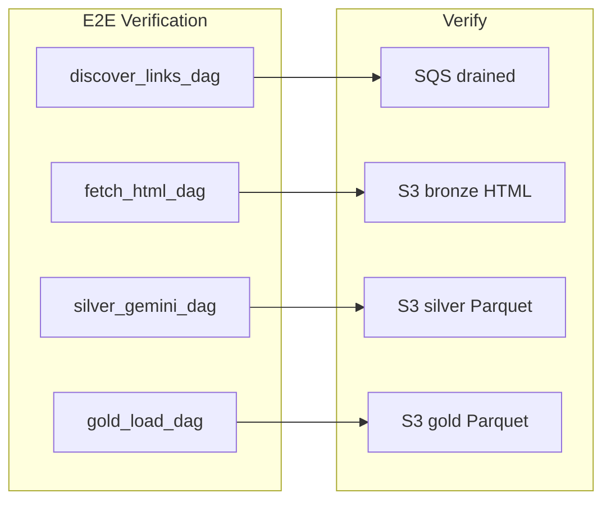

# Plan 6: Tests, Data Quality, and End-to-End Verification

After Plan 1 through Plan 5, consolidate testing, add data-quality checks, and create end-to-end verification. Reference: [vnexpress_manual_step_by_step_plan.plan.md](.cursor/plans/vnexpress_manual_step_by_step_plan.plan.md) Phases 8 and 9.

---

## Dependency


| Prerequisite                                      | Plan                                                                       |
| ------------------------------------------------- | -------------------------------------------------------------------------- |
| Gold DAG (and optionally ClickHouse)              | [plan_5_gold_load_dag.plan.md](.cursor/plans/plan_5_gold_load_dag.plan.md) |
| Existing tests (utils, url_utils, gemini_extract) | Plans 2–4                                                                  |


---

## Phases in This Plan


| Phase | Goal                                                       |
| ----- | ---------------------------------------------------------- |
| 1     | Add missing tests (gold load, clickhouse_utils if present) |
| 2     | Add silver validation (schema/data-quality)                |
| 3     | Create end-to-end verification script                      |
| 4     | Run full test suite in Docker; document                    |


---

## Phase 1: Missing Unit Tests

**Goal:** Add tests for gold logic and ClickHouse utils (created by Plan 5).


| Step | Action                                                                                                                                       | Reference                                                                        |
| ---- | -------------------------------------------------------------------------------------------------------------------------------------------- | -------------------------------------------------------------------------------- |
| 1.1  | If gold DAG exists: create `tests/test_gold_load.py` with mocked S3 (list_keys, read_key); test read silver Parquet, dedupe, column presence | [07-data-quality-and-testing.mdc](.cursor/rules/07-data-quality-and-testing.mdc) |
| 1.2  | If `utils/clickhouse_utils.py` exists: add `test_insert_articles_df` with `@patch` on clickhouse client                                      | [validation-testing](.cursor/skills/validation-testing/SKILL.md)                 |
| 1.3  | Ensure `pytest.ini` or `pyproject.toml` configures test paths and markers                                                                    | [12-docker-compose-testing.mdc](.cursor/rules/12-docker-compose-testing.mdc)     |


**Check:** `PYTHONPATH=.:src/dags pytest tests/ -v` passes (run in Docker).

---

## Phase 2: Data-Quality Validation

**Goal:** Add schema validation for silver output; optional `validate_silver` Airflow task.


| Step | Action                                                                                                                                    | Reference                                                                        |
| ---- | ----------------------------------------------------------------------------------------------------------------------------------------- | -------------------------------------------------------------------------------- |
| 2.1  | Create `utils/validation.py`: `validate_silver_schema(df: pd.DataFrame) -> bool` — assert `article_id`, `url`, `title` non-null/non-empty | [07-data-quality-and-testing.mdc](.cursor/rules/07-data-quality-and-testing.mdc) |
| 2.2  | Add `tests/test_validation.py`: test validate_silver_schema with valid/invalid DataFrames                                                 | [validation-testing](.cursor/skills/validation-testing/SKILL.md)                 |
| 2.3  | Optional: add `validate_silver` task to silver DAG or a separate validation DAG that runs after silver                                    | [07-data-quality-and-testing.mdc](.cursor/rules/07-data-quality-and-testing.mdc) |


**Check:** `validate_silver_schema` raises or returns False for invalid data.

---

## Phase 3: End-to-End Verification Script

**Goal:** Single script to run full pipeline (discover → fetch → silver → gold) and verify all layers.


| Step | Action                                                                                                                      | Reference                                                                    |
| ---- | --------------------------------------------------------------------------------------------------------------------------- | ---------------------------------------------------------------------------- |
| 3.1  | Create `scripts/verify_e2e.sh`: run discover, wait; run fetch, wait; run silver, wait; run gold (if present), wait          | [12-docker-compose-testing.mdc](.cursor/rules/12-docker-compose-testing.mdc) |
| 3.2  | Verify: SQS drained, S3 bronze has HTML, S3 silver has Parquet, S3 gold has Parquet; if ClickHouse enabled, query row count | [LOCAL_SETUP.md](LOCAL_SETUP.md)                                             |
| 3.3  | Make executable; document in LOCAL_SETUP.md                                                                                 | [LOCAL_SETUP.md](LOCAL_SETUP.md)                                             |


**Check:** `./scripts/verify_e2e.sh` completes; all layers have data.

---

## Phase 4: Test Suite and Documentation

**Goal:** Document how to run tests; ensure all tests pass in Docker.


| Step | Action                                                                                                                                                                      | Reference                                                                        |
| ---- | --------------------------------------------------------------------------------------------------------------------------------------------------------------------------- | -------------------------------------------------------------------------------- |
| 4.1  | Add "Run tests" section to [LOCAL_SETUP.md](LOCAL_SETUP.md): `docker compose exec -T airflow-scheduler bash -c "cd /opt/airflow && PYTHONPATH=.:src/dags pytest tests/ -v"` | [12-docker-compose-testing.mdc](.cursor/rules/12-docker-compose-testing.mdc)     |
| 4.2  | Add "Full pipeline (E2E)" section to LOCAL_SETUP.md with link to verify_e2e.sh                                                                                              | [LOCAL_SETUP.md](LOCAL_SETUP.md)                                                 |
| 4.3  | Run full test suite; fix any failures                                                                                                                                       | [07-data-quality-and-testing.mdc](.cursor/rules/07-data-quality-and-testing.mdc) |


**Check:** All tests pass; LOCAL_SETUP documents tests and E2E flow.

---

## Data Flow (E2E)




---

## Key Snippets

**validate_silver_schema** ([07-data-quality-and-testing.mdc](.cursor/rules/07-data-quality-and-testing.mdc)):

```python
def validate_silver_schema(df: pd.DataFrame) -> bool:
    required = ["article_id", "url", "title"]
    if not all(c in df.columns for c in required):
        return False
    return df[required].notna().all().all() and (df["title"].str.len() > 0).all()
```

**E2E script outline**:

```bash
# Trigger discover, fetch, silver, gold in sequence
# Wait between each
# Verify S3 bronze, silver, gold; SQS; optionally ClickHouse
```

---

## Key References

- **Testing:** [.cursor/rules/07-data-quality-and-testing.mdc](.cursor/rules/07-data-quality-and-testing.mdc)
- **Validation:** [.cursor/skills/validation-testing/SKILL.md](.cursor/skills/validation-testing/SKILL.md)
- **Docker tests:** [.cursor/rules/12-docker-compose-testing.mdc](.cursor/rules/12-docker-compose-testing.mdc)
- **Local setup:** [LOCAL_SETUP.md](LOCAL_SETUP.md)

