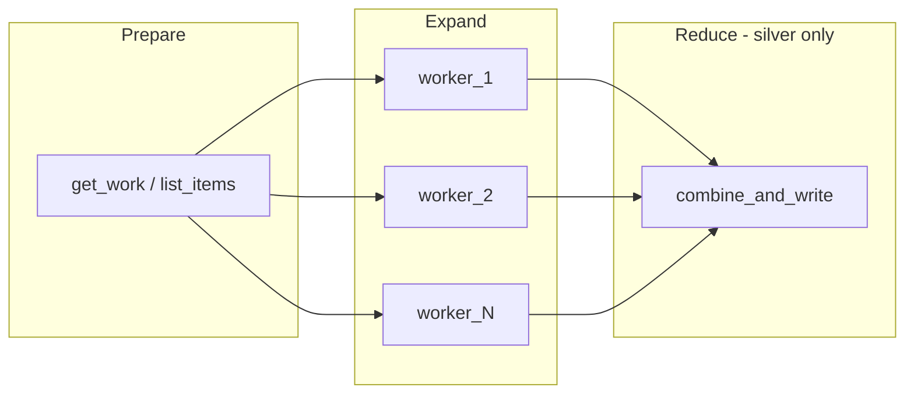
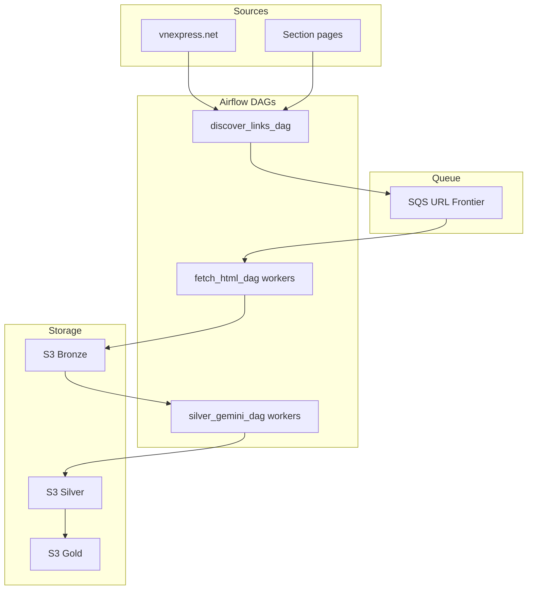

# Plan 7: Multi-Worker Celery and Mermaid Fix

Add parallel worker tasks to `fetch_html_dag` and `silver_gemini_dag` using the same pattern: prepare work → expand over chunks → process (and optional reduce). Scale Celery workers in Docker. Fix mermaid diagram in the main plan.

---

## Dependency


| Prerequisite                                                 | Plan                                     |
| ------------------------------------------------------------ | ---------------------------------------- |
| fetch_html_dag, silver_gemini_dag (current single-task impl) | Plans 3, 4                               |
| CeleryExecutor, Redis, airflow-worker                        | [docker-compose.yml](docker-compose.yml) |


---

## Shared Multi-Worker Pattern

Both DAGs follow this flow:




- **Prepare**: Gather work items (SQS batches or bronze key chunks).
- **Expand**: `@task.expand()` over work items so each runs on a Celery worker.
- **Reduce** (silver): Collect mapped results, dedupe, write Parquet.

---

## Phases in This Plan


| Phase | Goal                                                      |
| ----- | --------------------------------------------------------- |
| 1     | Refactor fetch_html_dag to multi-worker                   |
| 2     | Refactor silver_gemini_dag to multi-worker                |
| 3     | Scale airflow-worker in Docker Compose                    |
| 4     | Fix mermaid in vnexpress_manual_step_by_step_plan.plan.md |


---

## Phase 1: Fetch HTML DAG Multi-Worker

**Goal:** Replace single `fetch_html_batch` with N parallel worker tasks.


| Step | Action                                                                                                                                           | Reference                                                            |
| ---- | ------------------------------------------------------------------------------------------------------------------------------------------------ | -------------------------------------------------------------------- |
| 1.1  | Add `num_fetch_workers` to bronze config (e.g. 4)                                                                                                | [vnexpress_bronze.yml](src/dags/configs/bronze/vnexpress_bronze.yml) |
| 1.2  | Replace `fetch_html_batch` with: `@task get_fetch_work` returns `list(range(num_workers))` (worker ids)                                          | [06-airflow-dags.mdc](.cursor/rules/06-airflow-dags.mdc)             |
| 1.3  | `@task fetch_html_worker(worker_id: int)` — each worker loops: receive_message(batch_size), process, delete, until queue empty or max iterations | [02-ingestion-layer.mdc](.cursor/rules/02-ingestion-layer.mdc)       |
| 1.4  | Use `fetch_html_worker.expand(worker_id=get_fetch_work())` so N tasks run in parallel on Celery workers                                          | Airflow dynamic task mapping                                         |
| 1.5  | No reduce step: each worker writes directly to S3                                                                                                | [03-raw-storage-bronze.mdc](.cursor/rules/03-raw-storage-bronze.mdc) |


**Logic:** SQS visibility timeout ensures different workers get different messages. Each worker processes until queue is empty.

---

## Phase 2: Silver Gemini DAG Multi-Worker

**Goal:** Split bronze keys into chunks; map over chunks; reduce to single Parquet.


| Step | Action                                                                                                                      | Reference                                                            |
| ---- | --------------------------------------------------------------------------------------------------------------------------- | -------------------------------------------------------------------- |
| 2.1  | Add `num_silver_workers` or `silver_chunk_size` to silver config                                                            | [vnexpress_silver.yml](src/dags/configs/silver/vnexpress_silver.yml) |
| 2.2  | Task 1 `list_bronze_keys`: list S3 keys for ingestion_date, split into N chunks (each chunk = list of keys)                 | [04-transform-silver.mdc](.cursor/rules/04-transform-silver.mdc)     |
| 2.3  | Task 2 `silver_extract_chunk(keys: list[str])` — for each key: read HTML, call Gemini extract, return list of records       | [gemini_extract](src/dags/utils/gemini_extract.py)                   |
| 2.4  | Use `silver_extract_chunk.expand(keys=list_bronze_keys())` so each chunk runs on a Celery worker                            | Airflow dynamic task mapping                                         |
| 2.5  | Task 3 `silver_reduce`: receives XCom from mapped tasks (list of record lists), concat, dedupe by article_id, write Parquet | [s3_utils](src/dags/utils/s3_utils.py)                               |


**XCom:** Mapped tasks return `list[dict]`; reduce task uses `xcom_pull` or TaskFlow `reduce` pattern to collect.

---

## Phase 3: Scale Airflow Workers

**Goal:** Run multiple Celery workers so tasks execute in parallel.


| Step | Action                                                                                                                                              | Reference                                                                    |
| ---- | --------------------------------------------------------------------------------------------------------------------------------------------------- | ---------------------------------------------------------------------------- |
| 3.1  | Add `airflow-worker-2` (and optional `airflow-worker-3`) to [docker-compose.yml](docker-compose.yml) with unique hostname (e.g. `airflow-worker-2`) | [12-docker-compose-testing.mdc](.cursor/rules/12-docker-compose-testing.mdc) |
| 3.2  | Or use `deploy.replicas: 3` on airflow-worker (Docker Compose v3)                                                                                   | Docker docs                                                                  |
| 3.3  | Ensure `AIRFLOW__CELERY__WORKER_CONCURRENCY` or default allows parallel task execution per worker                                                   | Celery docs                                                                  |


**Check:** Trigger fetch DAG; multiple `fetch_html_worker` task instances run concurrently.

---

## Phase 4: Fix Mermaid in Main Plan

**Goal:** Fix diagram in [vnexpress_manual_step_by_step_plan.plan.md](.cursor/plans/vnexpress_manual_step_by_step_plan.plan.md) — valid IDs, show multi-worker.


| Step | Action                                                                                                                                 | Reference            |
| ---- | -------------------------------------------------------------------------------------------------------------------------------------- | -------------------- |
| 4.1  | Use valid mermaid node IDs: camelCase, no spaces, avoid reserved words (`end`, `graph`, `subgraph`)                                    | Mermaid syntax rules |
| 4.2  | Rename nodes: `workers` → `fetchWorkers` (or `fetchDag`), `silverDAG` → `silverDag`; ensure `bronzeS3`, `silverS3`, `goldS3` are valid | Plan file            |
| 4.3  | Add multi-worker visual: subgraph for workers showing parallel fetch/silver tasks                                                      | Architecture         |


**Fixed mermaid (proposed):**




(Note: `home` and `sections` as node IDs; brackets for labels with dots. If `vnexpress.net` causes issues, use `home[VnExpress Home]`.)

---

## Key Snippets

**Fetch: expand over worker IDs**

```python
@task
def get_fetch_work() -> list[int]:
    config = load_yml_configs(...)
    return list(range(config["data_config"]["num_fetch_workers"]))

@task
def fetch_html_worker(worker_id: int) -> dict:
    # Same loop as current fetch_html_batch; each worker competes for SQS messages
    ...

get_fetch_work() >> fetch_html_worker.expand(worker_id=get_fetch_work())
```

**Silver: expand over key chunks**

```python
@task
def list_bronze_keys() -> list[list[str]]:
    keys = [...]
    chunk_size = max(1, len(keys) // num_workers)
    return [keys[i:i+chunk_size] for i in range(0, len(keys), chunk_size)]

@task
def silver_extract_chunk(keys: list[str]) -> list[dict]:
    records = []
    for key in keys:
        # extract, append
    return records

@task
def silver_reduce(records_from_chunks: list) -> dict:
    all_records = [r for chunk in records_from_chunks for r in chunk]
    df = pd.DataFrame(all_records).drop_duplicates(subset=["article_id"], keep="last")
    write_parquet_to_s3(...)
```

---

## Key References

- **Airflow dynamic mapping:** [Dynamic Task Mapping](https://airflow.apache.org/docs/apache-airflow/2.3.2/concepts/dynamic-task-mapping.html)
- **Ingestion:** [.cursor/rules/02-ingestion-layer.mdc](.cursor/rules/02-ingestion-layer.mdc)
- **Silver:** [.cursor/rules/04-transform-silver.mdc](.cursor/rules/04-transform-silver.mdc)
- **Docker:** [.cursor/rules/12-docker-compose-testing.mdc](.cursor/rules/12-docker-compose-testing.mdc)

