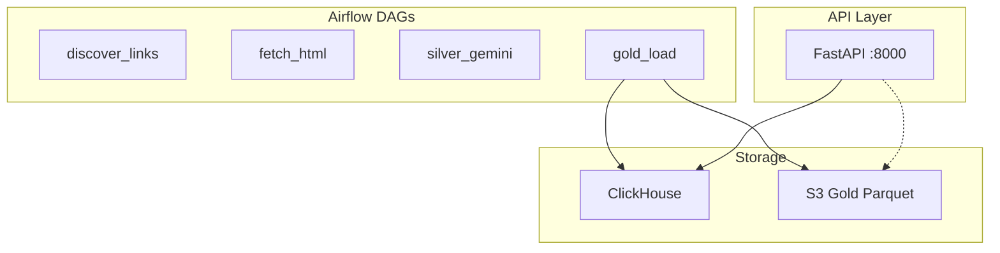

# Plan 8: FastAPI Integration

Add a **FastAPI** REST API layer on top of the VnExpress crawler pipeline. The API serves article data from the gold layer (ClickHouse or S3) for dashboards, mobile apps, or external integrations.

---

## Dependency


| Prerequisite                                           | Plan / Reference                                                                   |
| ------------------------------------------------------ | ---------------------------------------------------------------------------------- |
| Gold layer (S3 Parquet and/or ClickHouse)              | [plan_5_gold_load_dag.plan.md](.cursor/plans/plan_5_gold_load_dag.plan.md)         |
| Docker Compose stack                                   | [docker-compose.yml](docker-compose.yml)                                           |
| Article schema (article_id, url, title, section, etc.) | [05-analytics-gold-clickhouse.mdc](.cursor/rules/05-analytics-gold-clickhouse.mdc) |


---

## Phases


| Phase | Goal                                                  |
| ----- | ----------------------------------------------------- |
| 1     | Create FastAPI app with health and articles endpoints |
| 2     | Add ClickHouse and/or S3 data access for articles     |
| 3     | Add FastAPI service to Docker Compose                 |
| 4     | Document API and add optional DAG-trigger endpoint    |


---

## Phase 1: FastAPI App Skeleton

**Goal:** Minimal FastAPI app with health check and articles stub.


| Step | Action                                                                                                                |
| ---- | --------------------------------------------------------------------------------------------------------------------- |
| 1.1  | Create `api/` directory: `main.py`, `routers/articles.py`, `schemas/article.py`                                       |
| 1.2  | `GET /health` — return `{"status": "ok", "version": "..."}`                                                           |
| 1.3  | `GET /articles` — stub returning `[]` or sample data initially                                                        |
| 1.4  | Add `requirements-api.txt` with `fastapi`, `uvicorn`, `clickhouse-connect` (or `clickhouse-driver`), optional `boto3` |


**Example structure:**

```
api/
├── main.py           # FastAPI app, include routers
├── routers/
│   └── articles.py   # /articles, /articles/{article_id}
├── schemas/
│   └── article.py    # Pydantic models for response
└── db/
    └── clickhouse.py  # ClickHouse client helper
```

---

## Phase 2: Data Access

**Goal:** Connect FastAPI to ClickHouse and/or S3 for article queries.


| Step | Action                                                                                                                                                |
| ---- | ----------------------------------------------------------------------------------------------------------------------------------------------------- |
| 2.1  | **ClickHouse (recommended)** — `db/clickhouse.py`: connect using env `CLICKHOUSE_HOST`, `CLICKHOUSE_PORT`; query `vnexpress_articles` with pagination |
| 2.2  | **Optional S3 fallback** — when ClickHouse not enabled, read gold Parquet from S3 (Localstack or AWS); require `S3_BUCKET`, `S3_PREFIX`               |
| 2.3  | `GET /articles` — query params: `section`, `limit`, `offset`, `date_from`, `date_to`                                                                  |
| 2.4  | `GET /articles/{article_id}` — fetch single article by ID                                                                                             |
| 2.5  | Use Pydantic schemas for response validation                                                                                                          |


**Environment variables:**


| Var                | Purpose                                          |
| ------------------ | ------------------------------------------------ |
| `CLICKHOUSE_HOST`  | ClickHouse host (default `clickhouse` in Docker) |
| `CLICKHOUSE_PORT`  | HTTP port (default `8123`)                       |
| `S3_BUCKET`        | Fallback: bucket for gold Parquet                |
| `S3_PREFIX`        | Fallback: `vnexpress/gold/`                      |
| `AWS_ENDPOINT_URL` | Localstack: `http://localstack:4566`             |


---

## Phase 3: Docker Compose Integration

**Goal:** Run FastAPI as a service alongside Airflow.


| Step | Action                                                                                       |
| ---- | -------------------------------------------------------------------------------------------- |
| 3.1  | Add `fastapi` service to [docker-compose.yml](docker-compose.yml)                            |
| 3.2  | Command: `uvicorn api.main:app --host 0.0.0.0 --port 8000`                                   |
| 3.3  | Port: `8000:8000`                                                                            |
| 3.4  | Env: `CLICKHOUSE_HOST=clickhouse`, `CLICKHOUSE_PORT=8123`, `AWS_ENDPOINT_URL` for Localstack |
| 3.5  | Depends_on: clickhouse (optional), localstack (optional)                                     |
| 3.6  | Volumes: mount `./api` into container                                                        |


**Check:** `docker compose up -d fastapi`; `curl http://localhost:8000/health` returns 200.

---

## Phase 4: Documentation and Optional DAG Trigger

**Goal:** Document API; optionally add endpoint to trigger DAG runs.


| Step | Action                                                                                                                    |
| ---- | ------------------------------------------------------------------------------------------------------------------------- |
| 4.1  | FastAPI auto-generates OpenAPI docs at `/docs` (Swagger) and `/redoc`                                                     |
| 4.2  | Add "API" section to [LOCAL_SETUP.md](LOCAL_SETUP.md): URL, main endpoints                                                |
| 4.3  | **Optional** `POST /trigger/{dag_id}` — call Airflow REST API to trigger a DAG (requires Airflow API auth, use with care) |


---

## Optional: Crawlee Integration (Future Plan)

If you want to **improve the crawler** itself (e.g. better JS rendering, anti-detection, Playwright):


| Option           | Description                                                                                                       |
| ---------------- | ----------------------------------------------------------------------------------------------------------------- |
| **Crawlee**      | Modern Node/Python scraping library; Playwright/Puppeteer support; use in a separate "enhanced fetch" task or DAG |
| **Scrapy**       | Mature Python framework; different architecture (spider + middlewares)                                            |
| **Keep current** | `requests` + BeautifulSoup works for static VnExpress HTML; no change needed                                      |


**Recommendation:** Stick with the current `requests`-based fetch unless you need JS-rendered content. VnExpress article pages are mostly static HTML. Add Crawlee only if you expand to JS-heavy sites.

---

## Key Snippets

**FastAPI main app:**

```python
# api/main.py
from fastapi import FastAPI
from api.routers import articles

app = FastAPI(title="VnExpress API", version="0.1.0")
app.include_router(articles.router, prefix="/articles", tags=["articles"])

@app.get("/health")
def health():
    return {"status": "ok", "version": "0.1.0"}
```

**ClickHouse query example:**

```python
import clickhouse_connect
client = clickhouse_connect.get_client(host=host, port=8123)
rows = client.query("SELECT article_id, url, title, section, summary FROM default.vnexpress_articles LIMIT %(limit)s", parameters={"limit": 20})
```

---

## Architecture (with FastAPI)




---

## Key References

- **FastAPI:** [https://fastapi.tiangolo.com/](https://fastapi.tiangolo.com/)
- **ClickHouse Python:** [https://clickhouse.com/docs/en/integrations/python](https://clickhouse.com/docs/en/integrations/python)
- **Architecture:** [01-architecture-overview.mdc](.cursor/rules/01-architecture-overview.mdc)
- **Gold schema:** [05-analytics-gold-clickhouse.mdc](.cursor/rules/05-analytics-gold-clickhouse.mdc)

