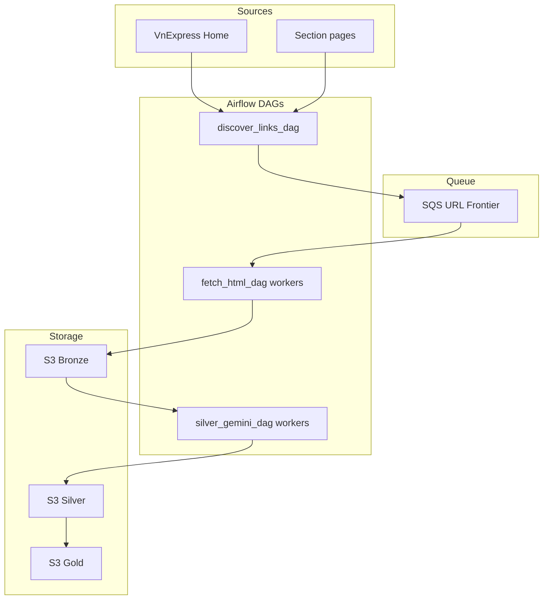

# VnExpress + Airflow + SQS + S3 + Localstack + Gemini — Step-by-Step Plan

This plan follows [.cursorrules](.cursorrules), [00-index.mdc](.cursor/rules/00-index.mdc), and [docker-compose-local-testing](.cursor/skills/docker-compose-local-testing/SKILL.md). You execute each step manually.

---

## Architecture Overview (VnExpress Crawler)




---

## Phase 0: Understand the Architecture

**Goal:** Grasp the data flow before implementing.


| Step | Action                                                                                         | Reference                                                                  |
| ---- | ---------------------------------------------------------------------------------------------- | -------------------------------------------------------------------------- |
| 0.1  | Read the architecture overview rule                                                            | [01-architecture-overview.mdc](.cursor/rules/01-architecture-overview.mdc) |
| 0.2  | Draw the flow: vnexpress.net → discover → SQS → fetch workers → S3 bronze → Gemini → S3 silver | [01-architecture-overview.mdc](.cursor/rules/01-architecture-overview.mdc) |
| 0.3  | Note the key DAGs: `discover_links`, `fetch_html`, `silver_gemini`, (optional) `gold_load`     | [06-airflow-dags.mdc](.cursor/rules/06-airflow-dags.mdc)                   |


**Check:** You understand: URLs go into SQS; workers pull URLs and write HTML to S3; silver reads HTML and calls Gemini to extract structured data.

---

## Phase 1: Docker Compose and Local Environment

**Goal:** Stack running with Localstack (S3 + SQS), Airflow, Postgres, Redis.


| Step | Action                                                                                                                                                                                              | Reference                                                                            |
| ---- | --------------------------------------------------------------------------------------------------------------------------------------------------------------------------------------------------- | ------------------------------------------------------------------------------------ |
| 1.1  | Run `docker compose up -d`; verify services healthy; open [http://localhost:8080](http://localhost:8080) (admin/admin)                                                                              | [12-docker-compose-testing.mdc](.cursor/rules/12-docker-compose-testing.mdc)         |
| 1.2  | Init Localstack: `AWS_ENDPOINT_URL=http://localhost:4566 awslocal s3 mb s3://vnexpress-data`; `awslocal sqs create-queue --queue-name vnexpress-url-frontier`                                       | [docker-compose-local-testing](.cursor/skills/docker-compose-local-testing/SKILL.md) |
| 1.3  | Airflow UI → Connections → Add: `aws_dag_executor`, Amazon Web Services, Login `test`, Password `test`, Extra `{"endpoint_url": "http://localstack:4566"}`                                          | [12-docker-compose-testing.mdc](.cursor/rules/12-docker-compose-testing.mdc)         |
| 1.4  | Airflow UI → Variables → Add: `vnexpress_s3_bucket` = `vnexpress-data`, `vnexpress_sqs_queue_url` = `http://localstack:4566/000000000000/vnexpress-url-frontier`, `vnexpress_environment` = `local` | [LOCAL_SETUP.md](LOCAL_SETUP.md)                                                     |


**Check:** `awslocal s3 ls` and `awslocal sqs list-queues` show bucket and queue; Airflow connection and variables set.

---

## Phase 2: Utils (Helper and S3)

**Goal:** Shared helpers for config loading and Parquet writes.


| Step | Action                                                                                                                                         | Reference                                                                                            |
| ---- | ---------------------------------------------------------------------------------------------------------------------------------------------- | ---------------------------------------------------------------------------------------------------- |
| 2.1  | Create `utils/helper.py`: `load_yml_configs(config_path) -> dict`, `validate_running_env(env) -> str`                                          | [resource-reference-codebase-patterns](.cursor/skills/resource-reference-codebase-patterns/SKILL.md) |
| 2.2  | Create `utils/s3_utils.py`: `write_parquet_to_s3(s3_hook, df, bucket, prefix)` — convert DataFrame to Parquet, upload via `s3_hook.load_bytes` | [s3-sqs-ingestion](.cursor/skills/s3-sqs-ingestion/SKILL.md)                                         |


**Check:** Unit test: `load_yml_configs` returns dict; `test_write_parquet_to_s3` with `@mock_aws` passes.

---

## Phase 3: Bronze Config

**Goal:** YAML config for discovery seeds and S3 layout.


| Step | Action                                                                                                                | Reference                                                                                |
| ---- | --------------------------------------------------------------------------------------------------------------------- | ---------------------------------------------------------------------------------------- |
| 3.1  | Create or update `configs/bronze/vnexpress_bronze.yml`: seed_urls, allowed_url_patterns, s3_output_prefix, batch_size | [config-yaml-bronze-silver-gold](.cursor/skills/config-yaml-bronze-silver-gold/SKILL.md) |


**Check:** `load_yml_configs` loads it; `config["data_config"]["seed_urls"]` is a list.

---

## Phase 4: Link Discovery (Discover DAG)

**Goal:** DAG that fetches seed URLs, extracts article links, pushes to SQS.


| Step | Action                                                                                                                                                        | Reference                                                                                                                      |
| ---- | ------------------------------------------------------------------------------------------------------------------------------------------------------------- | ------------------------------------------------------------------------------------------------------------------------------ |
| 4.1  | Create `utils/url_utils.py`: `normalize_url(url)`, `extract_article_links(html, pattern)` with BeautifulSoup                                                  | [02-ingestion-layer.mdc](.cursor/rules/02-ingestion-layer.mdc)                                                                 |
| 4.2  | Create `vnexpress_discover_links_dag.py`: `@dag` schedule `0 2` * * *; `@task discover_links` loads config, fetches seeds, extracts links, pushes JSON to SQS | [06-airflow-dags.mdc](.cursor/rules/06-airflow-dags.mdc), [dag-airflow-patterns](.cursor/skills/dag-airflow-patterns/SKILL.md) |


**Check:** Trigger DAG; `awslocal sqs receive-message --queue-url ...` shows messages.

---

## Phase 5: HTML Fetch (Fetch DAG)

**Goal:** DAG that drains SQS, fetches HTML per URL, writes to S3 bronze.


| Step | Action                                                                                                                                                                      | Reference                                                                                                                            |
| ---- | --------------------------------------------------------------------------------------------------------------------------------------------------------------------------- | ------------------------------------------------------------------------------------------------------------------------------------ |
| 5.1  | Create `vnexpress_fetch_html_dag.py`: `@task fetch_html_batch` — SqsHook.receive_messages; for each message: GET url, derive article_id, s3_hook.load_bytes, delete message | [02-ingestion-layer.mdc](.cursor/rules/02-ingestion-layer.mdc), [03-raw-storage-bronze.mdc](.cursor/rules/03-raw-storage-bronze.mdc) |


**Check:** Run discover then fetch; `awslocal s3 ls s3://vnexpress-data/vnexpress/bronze/` shows `.html` files.

---

## Phase 6: Silver Config and Gemini (Silver DAG)

**Goal:** Read bronze HTML, call Gemini to extract structured fields, write Parquet to S3 silver.


| Step | Action                                                                                                                                              | Reference                                                                                |
| ---- | --------------------------------------------------------------------------------------------------------------------------------------------------- | ---------------------------------------------------------------------------------------- |
| 6.1  | Add `gemini_api_key` Variable in Airflow UI                                                                                                         | [04-transform-silver.mdc](.cursor/rules/04-transform-silver.mdc)                         |
| 6.2  | Create or update `configs/silver/vnexpress_silver.yml`: gemini_model, max_body_chars, batch_size, silver_prefix                                     | [config-yaml-bronze-silver-gold](.cursor/skills/config-yaml-bronze-silver-gold/SKILL.md) |
| 6.3  | Create `utils/gemini_extract.py`: `extract_article_from_html(html, api_key, model) -> dict` — call Gemini, parse JSON                               | [gemini-silver-extraction](.cursor/skills/gemini-silver-extraction/SKILL.md)             |
| 6.4  | Create `vnexpress_silver_gemini_dag.py`: list bronze keys, download HTML, call extract, dedupe by article_id, write Parquet via write_parquet_to_s3 | [04-transform-silver.mdc](.cursor/rules/04-transform-silver.mdc)                         |


**Check:** Run discover → fetch → silver; S3 silver prefix has Parquet files.

---

## Phase 7: Gold (Optional)

**Goal:** Read silver Parquet, dedupe, write gold output.


| Step | Action                                                                                                                                                        | Reference                                                                          |
| ---- | ------------------------------------------------------------------------------------------------------------------------------------------------------------- | ---------------------------------------------------------------------------------- |
| 7.1  | Create `vnexpress_gold_load_dag.py`: read silver for ingestion_date, dedupe by article_id, write gold Parquet or CSV to `vnexpress/gold/ingestion_date={ds}/` | [05-analytics-gold-clickhouse.mdc](.cursor/rules/05-analytics-gold-clickhouse.mdc) |


**Check:** Run full pipeline; gold output exists in S3.

---

## Phase 8: Tests and Data Quality

**Goal:** Unit tests for utils and mocked Gemini; run tests in Docker.


| Step | Action                                                                                                                                          | Reference                                                                        |
| ---- | ----------------------------------------------------------------------------------------------------------------------------------------------- | -------------------------------------------------------------------------------- |
| 8.1  | Add unit tests: `test_load_yml_configs`, `test_validate_running_env`, `test_write_parquet_to_s3` with `@mock_aws`, `test_extract_article_links` | [07-data-quality-and-testing.mdc](.cursor/rules/07-data-quality-and-testing.mdc) |
| 8.2  | Add `test_extract_article_from_html` with `@patch` on Gemini client                                                                             | [validation-testing](.cursor/skills/validation-testing/SKILL.md)                 |
| 8.3  | Run `docker compose run --rm airflow-cli bash -c "PYTHONPATH=.:src/dags pytest tests/ -v"`                                                      | [12-docker-compose-testing.mdc](.cursor/rules/12-docker-compose-testing.mdc)     |


**Check:** All tests pass.

---

## Phase 9: End-to-End Verification

**Goal:** Full pipeline run and layer verification.


| Step | Action                                                                                                                                                    | Reference                                                                    |
| ---- | --------------------------------------------------------------------------------------------------------------------------------------------------------- | ---------------------------------------------------------------------------- |
| 9.1  | Run: `docker compose up -d`; trigger `vnexpress_discover_links_dag`; then `vnexpress_fetch_html_dag`; then `vnexpress_silver_gemini_dag`; (optional) gold | [12-docker-compose-testing.mdc](.cursor/rules/12-docker-compose-testing.mdc) |
| 9.2  | Verify: SQS messages pushed then drained; S3 bronze has HTML; S3 silver has Parquet; S3 gold (if implemented) has output                                  | [LOCAL_SETUP.md](LOCAL_SETUP.md)                                             |


**Milestone:** Full VnExpress crawler pipeline complete.

---

## Target File Tree

```
src/
├── dags/
│   ├── vnexpress_full_flow/
│   │   ├── vnexpress_discover_links_dag.py
│   │   ├── vnexpress_fetch_html_dag.py
│   │   ├── vnexpress_silver_gemini_dag.py
│   │   └── vnexpress_gold_load_dag.py  (optional)
│   ├── configs/
│   │   ├── bronze/
│   │   │   └── vnexpress_bronze.yml
│   │   ├── silver/
│   │   │   └── vnexpress_silver.yml
│   │   └── gold/
│   │       └── vnexpress_gold.yml
│   └── utils/
│       ├── helper.py
│       ├── s3_utils.py
│       ├── url_utils.py
│       └── gemini_extract.py
tests/
├── test_utils.py
├── test_gemini_extract.py
└── test_data/
    └── (fixtures)
docker-compose.yml
```

---

## Troubleshooting


| Issue                    | Check                                                            |
| ------------------------ | ---------------------------------------------------------------- |
| DAG not appearing        | Volumes mounted? `src/dags` → `/opt/airflow/dags`                |
| S3/SQS connection failed | Connection `aws_dag_executor` has `endpoint_url`? Variables set? |
| Localstack empty         | Run init commands (Phase 1.2)                                    |
| Gemini rate limit        | Reduce batch_size; add retries and backoff                       |


---

## Key References

- **Architecture:** [.cursor/rules/01-architecture-overview.mdc](.cursor/rules/01-architecture-overview.mdc)
- **Docker Compose:** [.cursor/rules/12-docker-compose-testing.mdc](.cursor/rules/12-docker-compose-testing.mdc)
- **Ingestion:** [.cursor/rules/02-ingestion-layer.mdc](.cursor/rules/02-ingestion-layer.mdc)
- **Silver/Gemini:** [.cursor/rules/04-transform-silver.mdc](.cursor/rules/04-transform-silver.mdc)
- **Skills:** [docker-compose-local-testing](.cursor/skills/docker-compose-local-testing/SKILL.md), [s3-sqs-ingestion](.cursor/skills/s3-sqs-ingestion/SKILL.md), [gemini-silver-extraction](.cursor/skills/gemini-silver-extraction/SKILL.md)

