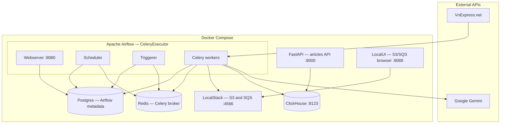
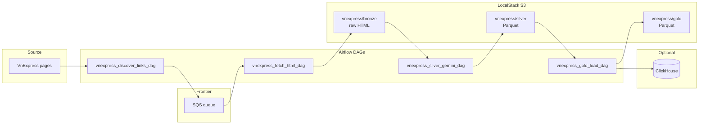

# VnExpress Crawler ETL

End-to-end pipeline for **[VnExpress](https://vnexpress.net/)** news: discover article URLs, push them to an **SQS** queue as a URL frontier, run **Celery-backed Airflow workers** to fetch HTML into **S3 bronze**, use **Google Gemini** to extract structured fields into **silver (Parquet)**, then build **gold** tables with optional **ClickHouse** for analytics and a small **HTTP API**. Everything is orchestrated with **Apache Airflow**.

---

## System architecture

### Runtime (Docker Compose)

Services share the `airflow_network` bridge (except host-published ports). **Airflow** uses **Postgres** for metadata and **Redis** as the **Celery** broker; workers and the scheduler call **LocalStack** (S3/SQS), **Gemini** (silver), and optionally **ClickHouse** (gold).



### Data flow (medallion + DAGs)

Logical pipeline: discover → queue → fetch → bronze → silver (LLM) → gold → optional analytics store.



---

## What it does

- **Discovery** — Crawl the homepage and configured section pages; normalize and dedupe article URLs; enqueue one message per URL.
- **Bronze** — Workers poll SQS in batches, download each page, and store raw HTML under a dated prefix (ingestion date + source + article id).
- **Silver** — For each bronze object, send truncated HTML to Gemini with a strict extraction prompt; write normalized rows to Parquet.
- **Gold** — Dedupe and aggregate silver into analytics-friendly Parquet; optionally load into ClickHouse for SQL and dashboards.
- **Local AWS** — **Localstack** emulates S3 and SQS on your machine so you do not need a real AWS account for development.
- **Execution model** — Airflow uses **CeleryExecutor** with Redis as the broker so fetch and other heavy tasks can run on multiple workers in parallel.

---

## Prerequisites

- **Docker** and **Docker Compose** installed and running.
- **AWS CLI** on your host (optional but recommended) to create the Localstack bucket and queue with two commands. If you do not install it, use any S3/SQS client pointed at `http://localhost:4566` with dummy credentials.
- A **Google AI API key** for the silver step — configure it only as an Airflow Variable (never commit secrets).

---

## Run the stack (first time)

From the top-level project folder (where you cloned or unpacked the code):

```bash
docker compose up -d
```

The first run may take several minutes while images are pulled and the Airflow image is built. Check status with:

```bash
docker compose ps
```

You should see Postgres, Redis, Localstack, ClickHouse, Airflow (webserver, scheduler, workers, init), and the FastAPI service once healthy.

---

## Initialize Localstack (once per fresh volume)

After Localstack is accepting traffic on port **4566**, create the demo bucket and queue (dummy credentials are fine):

```bash
AWS_ACCESS_KEY_ID=test AWS_SECRET_ACCESS_KEY=test AWS_DEFAULT_REGION=us-east-1 \
  aws --endpoint-url=http://localhost:4566 s3 mb s3://vnexpress-data

AWS_ACCESS_KEY_ID=test AWS_SECRET_ACCESS_KEY=test AWS_DEFAULT_REGION=us-east-1 \
  aws --endpoint-url=http://localhost:4566 sqs create-queue --queue-name vnexpress-url-frontier
```

If the bucket or queue already exists, you may see a harmless error; that is OK.

---

## Configure Airflow (browser)

Open **http://localhost:8080** and sign in (default admin user is often created by the init container; use the credentials you set in the environment if you changed them).

### Variables

Add these under **Admin → Variables**:

| Key | Suggested local value |
|-----|------------------------|
| `vnexpress_s3_bucket` | `vnexpress-data` |
| `vnexpress_sqs_queue_url` | `http://localstack:4566/000000000000/vnexpress-url-frontier` |
| `vnexpress_environment` | `local` |
| `gemini_api_key` | Your Google AI key (required before running silver) |
| `gemini_model` | e.g. `gemini-2.5-flash` (optional if your DAG reads model from config) |
| `clickhouse_enabled` | `true` only if you want gold to load into ClickHouse |

### Connection

Under **Admin → Connections**, add:

- **Connection Id**: `aws_dag_executor`
- **Connection Type**: Amazon Web Services
- **Login**: `test`
- **Password**: `test`
- **Extra** (JSON): `{"endpoint_url": "http://localstack:4566"}`

This routes S3 and SQS hooks to Localstack. For production AWS, remove the endpoint override and use real credentials and bucket/queue values in Variables.

---

## Run the DAGs (order matters)

1. Enable and trigger **`vnexpress_discover_links_dag`** — fills the queue with article URLs.
2. Trigger **`vnexpress_fetch_html_dag`** — workers consume the queue and write HTML to bronze in S3.
3. Trigger **`vnexpress_silver_gemini_dag`** — requires `gemini_api_key`; produces silver Parquet.
4. Trigger **`vnexpress_gold_load_dag`** — builds gold from silver; loads ClickHouse when enabled.

Use the Airflow UI to monitor logs and task retries.

---

## Ports (typical)

| What | Port |
|------|------|
| Airflow UI | 8080 |
| Localstack (S3/SQS) | 4566 |
| **LocalStack web UI** (LocalUI: buckets, objects, SQS) | **8088** |
| ClickHouse HTTP | 8123 |
| Article HTTP API | 8000 |

### LocalStack web UI (optional)

Compose includes **[LocalUI](https://github.com/Dabolus/localui)** (`localstack-ui`) so you can browse **S3** and **SQS** in a browser. After `docker compose up -d`, open **http://localhost:8088** (override with `LOCALSTACK_UI_PORT` in `.env`). Official LocalStack’s full web app is **Pro**-only; LocalUI is a separate open-source UI.

**If buckets/queues look empty:**

1. **Recreate the UI** after changing compose: `docker compose up -d --force-recreate localstack-ui`.
2. Open S3 with the endpoint query param (LocalUI matches the SDK client by exact URL):  
   **http://localhost:8088/s3/buckets?endpoint=http%3A%2F%2Flocalstack%3A4566**  
   SQS: **http://localhost:8088/sqs/queues?endpoint=http%3A%2F%2Flocalstack%3A4566**
3. Confirm data exists from the host:  
   `aws --endpoint-url=http://localhost:4566 s3 ls` and `aws --endpoint-url=http://localhost:4566 sqs list-queues`
4. LocalStack uses a **named volume** (`localstack-data`) so S3/SQS survive container restarts; if you removed volumes with `docker compose down -v`, run the bucket/queue setup commands again from [Initialize Localstack](#initialize-localstack-once-per-fresh-volume).

---

## Tests

Run **pytest** with verbose output inside the **Airflow scheduler** container. Set the shell working directory to the Airflow home and extend **PYTHONPATH** so DAG modules and shared helpers resolve the same way as at runtime (typically the Airflow home plus the DAGs tree). Use the same scheduler service name your stack defines.

---

## Project shape (conceptual)

- **Airflow DAGs** — One logical “full flow” package holds discover, fetch, silver, and gold DAGs.
- **YAML configuration** — Separate bronze, silver, and gold settings (seed URLs, prefixes, model names, batch sizes).
- **Shared Python helpers** — URL rules, HTTP fetch, Gemini calls, validation, optional ClickHouse helpers.
- **HTTP API** — Serves article-style reads from ClickHouse when data has been loaded.
- **Automated tests** — Pytest against utilities and pipeline behavior; run inside containers for consistency.

---

## License / attribution

Airflow-related Docker patterns follow common Apache Airflow examples. Application logic and configuration are for learning and demonstration.
